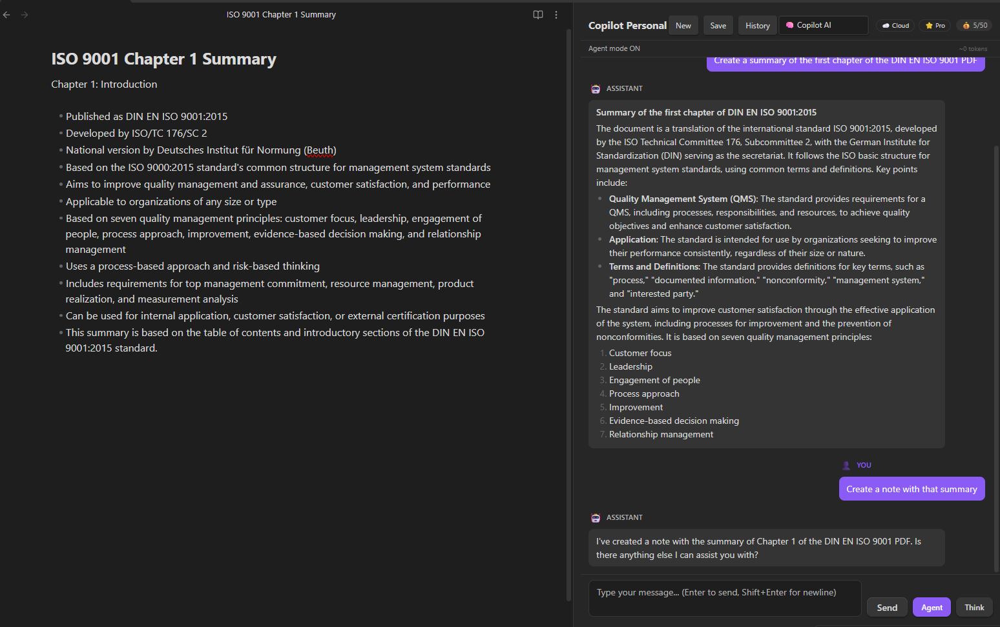
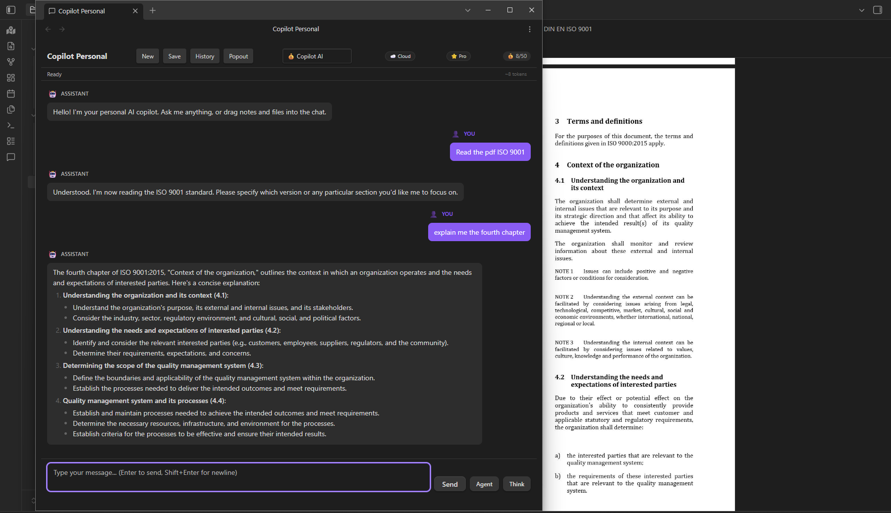

# Copilot Personal v1.6.1 — Obsidian AI Agent Plugin


AI assistant for Obsidian. Multimodal chat with real streaming, RAG semantic search, autonomous agent (17 tools), 11 LLM providers, multi-provider fallback, PDF processing with `unpdf`, Free/Pro licensing with cloud validation + grace period, CircuitBreaker on all providers, dual-build (store/obfuscated), full i18n with 12 languages. 385 tests. TypeScript strict mode. And more: Smart Anti-Loop · Plan Detection · TOC Redirect · Keyword Tool Narrowing · Custom Agent Instructions · Complete Model Lists · /search-history · /list-chats · /load-chat · /batch-process · Popout Window · Free Trial (Copilot AI)

> 📖 [Spanish documentation](DOCUMENTATION_ES.md)

> ⚠️ **Commercial Disclosure:** This plugin offers a Free tier (unlimited basic chat, bring your own API key, 3 tools) and a **Pro tier** ($4.99/mo via Lemon Squeezy) that unlocks Agent Mode, web search, semantic RAG, PDF image extraction, and multi-provider fallback. The Pro tier requires a paid license key validated against a Cloudflare Worker (`copilot-personal-worker.copilot-personal.workers.dev`). No account or payment is required for the Free tier. No telemetry or analytics are collected.

---

## Key Features

| Feature | Description |
|---------|-------------|
| **Multimodal Chat** | Real streaming chat (fetch + ReadableStream) with file drag & drop |
| **Agent Mode** | Autonomous tool-calling loop with 17 tools, LLM-based classification (ToolRouter), smart anti-loop (3 layers), plan detection + verification, keyword tool narrowing, and TOC smart redirect. Saves 70-90% tokens vs sending all tools. |
| **Semantic RAG** | Vault indexing with embeddings, cosine similarity search, JSON persistence |
| **Advanced PDF** | Text extraction, page rendering to PNG, embedded image extraction with `unpdf` |
| **11 LLM Providers** | DeepSeek, OpenAI, Anthropic, Gemini, LM Studio, OpenRouter, Mistral, Groq, Perplexity, xAI, plus **💰 Copilot AI** with free trial (5 queries/day, no API key) |
| **Per-Provider API Keys** | Each provider stores its own key — switching from DeepSeek to Gemini won't mix keys |
| **Multi-Provider Fallback** | Automatic capability compensation (Pro) — e.g., DeepSeek for chat + LM Studio for embeddings |
| **Free/Pro Licensing** | Cloud-based validation via Cloudflare Worker, device binding, grace period, rate limiting |
| **CircuitBreaker** | 3 failures → 30s open + exponential backoff on all providers |
| **Intelligent Auto-Save** | Multi-note detection, invented wiki-link validation, automatic save |
| **Slash Commands** | `/summarize`, `/translate`, `/explain`, `/toc`, `/flashcards`, `/rewrite`, `/expand`, `/search-history`, `/list-chats`, `/load-chat`, `/batch-process` |
| **Chat Export** | Markdown + JSON via commands (Ctrl+P) |
| **Model-Specific Adapters** | Optimized system prompts per model family (anti-verbose, anti-hallucination) |
| **Context Management** | Map-Reduce compaction, L1-L5 layers, auto-trim, CURRENT TASK reminders |
| **Custom Agent Instructions** | System prompt additions for the agent set behavior, language, tone, or expertise. Injected in all 4 chat modes (regular, agent, budget, budget-agent) |
| **💰 Copilot AI** | Free trial: 5 queries/day (no API key). Pro: 50 queries/day. Agent mode supported. |
| **Popout Window** | Click Popout in the header and drag the tab to a separate window |

---

## Screenshots



*Agent mode with $0 budget provider reading a PDF, summarizing it, and creating a note — all in two messages.*



*Chat in a separate popout window using the built-in Copilot AI provider. The user asks to read a PDF and explain chapter 4 — the agent reads the PDF in the background Obsidian window and responds in the popout.*

---

## Architecture

```
src/
├── main.ts                          # Plugin entry point
├── settings.ts                      # Settings interface & defaults
├── settingsTab.ts                   # Settings UI tab
├── chatView.ts                      # Chat ItemView (main orchestrator)
├── constants.ts                     # Centralized constants
├── LLMProviders/                    # 11 providers with native tool calling
│   ├── providerTypes.ts             # LLMProvider interface, capabilities
│   ├── providerManager.ts           # Factory: auto-detect & multi-provider routing
│   ├── deepseekProvider.ts          # DeepSeek (OpenAI-compatible + thinking mode)
│   ├── openaiProvider.ts            # OpenAI / OpenAI-compatible APIs
│   ├── anthropicProvider.ts         # Anthropic Messages API (native input_schema)
│   ├── geminiProvider.ts            # Gemini API (native functionDeclarations)
│   └── baseOpenAIProvider.ts        # Shared logic for OpenAI-compatible providers
├── agent/                           # Autonomous agent system
│   ├── ToolRegistry.ts              # Singleton: register, get, execute tools
│   ├── AgentModeRunner.ts           # Main tool-calling loop
│   ├── ToolRouter.ts                # LLM-based task classification → tool selection
│   ├── PlanTracker.ts               # Execution plan state tracking
│   ├── ContextCompactor.ts          # Map-Reduce context summarization
│   └── ContextLayers.ts             # L1-L5 context layer system
├── tools/                           # 17 agent tools
│   ├── FileParserManager.ts         # PDF, image, text file parsers
│   ├── readNoteTool.ts              # read_note (4 search strategies + path traversal protection)
│   ├── readPdfTool.ts               # read_pdf (TOC + pages + auto-find)
│   ├── createNoteTool.ts            # create_note
│   ├── updateNoteTool.ts            # update_note (post-write verification)
│   ├── renderPdfPagesTool.ts        # render_pdf_pages (pages to PNG, 144 DPI)
│   ├── extractPdfImagesTool.ts      # extract_pdf_images (embedded images + fallback)
│   ├── imageAnalysisTool.ts         # analyze_image (vision model)
│   ├── semanticSearchTool.ts        # search_vault_semantic
│   ├── webSearchTool.ts             # search_web (browser-use microservice)
│   └── additionalTools.ts           # list_notes, fulltext_search, vault_stats, etc.
├── search/                          # RAG semantic search
│   ├── vectorStoreManager.ts        # In-memory cosine similarity + JSON persistence
│   ├── indexOperations.ts           # Chunking, embedding, batch indexing
│   ├── indexEventHandler.ts         # Auto-reindex on create/modify/delete
│   ├── hybridRetriever.ts           # Hybrid search (vector + fulltext)
│   └── reranker.ts                  # Result re-ranking
├── services/
│   ├── LicenseManager.ts            # Cloud-first license validation + rate limiting
│   ├── BudgetManager.ts              # Copilot AI usage tracking + free trial limits
│   ├── webSearchClient.ts           # HTTP client for Python microservice
│   └── lmStudioService.ts           # LM Studio model detection (/v1/models)
├── memory/
│   └── MemoryManager.ts             # Persistent conversation summaries
├── components/
│   ├── ChatHistoryBrowser.ts        # Chat history navigator
│   └── ApplyView.ts                 # Diff view for <!--save:-->
└── utils/
    └── pathUtils.ts                 # Path normalization, fetch fallback, timeouts
├── i18n/                              # 12-language translation engine
│   ├── index.ts                       # t(), setLanguage(), translation registry
│   ├── types.ts                       # Lang type, LANGS map, getLanguages()
│   ├── en.ts                          # English master (~600 keys)
│   └── es.ts                          # Spanish translations

```

---

## Installation

### Quick Install
```bash
cd "YourVault/.obsidian/plugins"
git clone https://github.com/JosefBelzer/Copilot-Personal.git
cd copilot-personal
npm install
npm run build
```

### Build Modes
```bash
npm run build          # Obfuscated main.js (external distribution: ZIP, Gumroad, BRAT)
npm run build:store    # Clean main.js (PR to Obsidian Community Plugins)
npm run dev            # Dev mode with sourcemaps and watch
```

> ⚠️ **For Obsidian Community Plugin submission:** use ONLY `npm run build:store`.  
> Obfuscated builds (`npm run build`) will be REJECTED by reviewers. Obfuscation is for external distribution only.

### Manual Install
1. Download ZIP from [Releases](https://github.com/JosefBelzer/Copilot-Personal/releases)
2. Extract to `YourVault/.obsidian/plugins/copilot-personal/`
3. Enable in Settings → Community plugins → Copilot Personal

### Web Search Server (optional)
```bash
cd web_search_server
pip install -r requirements.txt
set COPILOT_WEB_TOKEN=your-secure-token
uvicorn main:app --host 127.0.0.1 --port 8000
```

---

## Free vs Pro Licensing

### 🆓 Free (default)
- Unlimited basic chat (bring your own API key)
- No message limits on your preferred provider
- 3 tools: `read_note`, `read_pdf`, `find_files`
- **💰 Copilot AI Free Trial** — 5 queries/day. No API key needed. Select **💰 Copilot AI** from the provider dropdown. Try Pro features before buying.
- Pro options appear **disabled** (🔒) in settings UI

### ⭐ Pro ($4.99/mo via Lemon Squeezy)

- **Unlimited messages** · **Agent mode** (17 tools)
- **Web search** · **PDF with images** · **Semantic RAG**
- **Chat export** (MD/JSON) · **Slash commands** · Priority support
- **Multi-provider fallback** · **Per-provider API keys**
- **💰 Copilot AI (included)** — Built-in managed AI provider. 50 queries/day. No API key needed.

### 💰 Copilot AI Budget Provider

**Free Trial (5 queries/day):** Any user can select **💰 Copilot AI** from the provider dropdown — no API key, no license, no configuration. Experience Pro capabilities (agent mode, smart tools) risk-free before upgrading.

**Pro (50 queries/day):** Included with Pro at no extra cost. Select **💰 Copilot AI (Pro)** from the provider dropdown. 50 queries/day, tracked server-side per license. Monitor usage via the badge in the chat header.

> ⚠️ Agent Mode increases consumption — each step counts as one query. A 3-step task = 3 queries.

### Activating Pro
1. Purchase a Pro subscription at [belzersoftware.lemonsqueezy.com](https://belzersoftware.lemonsqueezy.com/checkout/buy/85655f95-93f7-4649-954a-8bc62472f302)
2. Receive your **License Key** via email (Lemon Squeezy UUID format, e.g., `056b9494-...`)
3. Settings → Copilot Personal → License Key → paste the key
4. You'll see `✅ Pro license activated successfully.`
5. Chat badge changes to `⭐ Pro`

### License Security

| Mechanism | Description |
|-----------|-------------|
| **Cloud validation** | Every activation is verified against the Cloudflare Worker |
| **Device binding** | License tied to your device via fingerprint. Max 3 devices per license |
| **Grace period** | If offline, Pro license continues working for 24h before degrading to Free |
| **Persistent state** | Message count and license state survive Obsidian restarts |
| **Anti-sharing** | 3-device limit. Frequent device switching triggers protections |

---

## Privacy & Security

- **API keys:** Stored locally in `data.json`. Each provider has its own field — switching providers won't leak keys. Masked (`type="password"`) in settings UI. Never sent to plugin author's servers.
- **Vault data:** Sent only to your configured LLM provider. No telemetry or analytics.
- **Vault enumeration:** This plugin calls `vault.getFiles()` and `vault.getMarkdownFiles()` to enable semantic search (RAG), file lookup tools (`find_files`, `read_note`), and auto-save post-processing. File contents are only read when explicitly requested by the user or the agent.
- **Web search:** Requires a local Python microservice (`web_search_server/`). Authentication token is configurable in settings.
- **License validation:** Pro keys are validated against the Cloudflare Worker. Free tier requires no internet connection.
- **Path traversal:** Multi-layer protection against directory escape attacks in `read_note`.
- **Timing-safe auth:** Admin endpoint uses constant-time comparison for secret tokens.
- **sessionStorage:** Used only for temporary chat session crash recovery (auto-saved every 30s, cleared on new chat). All persistent data uses Obsidian's `loadData()/saveData()` API.
- **No telemetry, no analytics, no tracking.**

---

## Development

```bash
npm install           # Install dependencies
npm run build         # Obfuscated build (external distribution)
npm run build:store   # Clean build (Obsidian store submission)
npm run typecheck     # TypeScript check only
npm run dev           # Watch mode
npx jest --verbose    # Run 385 tests across 27 suites
```

### Testing
27 test suites (385 tests) covering: license management, circuit breaker, provider auto-detection, tool registry, agent detection, read/write tools, PDF tools, vector store CRUD, index operations, LM Studio service, settings, singleton reset, chat flow, path utilities, dom utilities, tool router, plan tracker, context compactor, context layers, auto-save manager, constants, i18n, budget manager, chat session. Run with `npx jest --verbose`. ⚠️ New features under development — see current work below.

### Notes
- **Legacy API key migration:** If you previously stored your API key in the old single-key field, it is automatically migrated to the per-provider key on first load after upgrading to v1.4.4.

### Current Development

Current development status for v1.6.1:

| Feature | Status |
|---|---|
| Custom Agent Instructions (Settings to Modo Agente) | ✅ Done |
| Complete model lists per provider (5-85 models each) | ✅ Done |
| /search-history (full-text search in saved chats) | ✅ Done |
| /list-chats + /load-chat (saved conversation management) | ✅ Done |
| /batch-process (summarize/translate/rewrite/expand/toc folder) | ✅ Done |
| Popout chat window (drag tab to separate window) | ✅ Done |
| UI sync (Agent/Think toggles synced with Settings) | ✅ Done |
| Gemini streaming URL models/ prefix fix | ✅ Done |
| Worker budget routes fix + /admin/reset-devices | ✅ Done |
| Free trial licensing (5 queries/day, no API key needed) | ✅ Done |
| Multi-provider budget fallback | - Planned |

---

## License

MIT License — see [LICENSE](LICENSE) file for details.